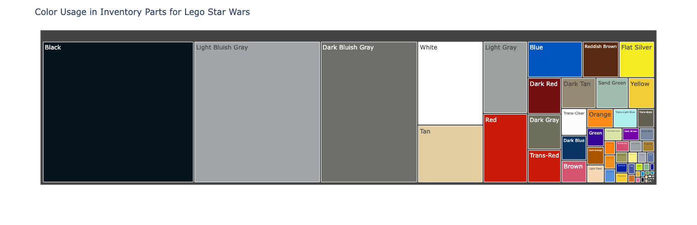

# LEGO Star Wars Color Analysis

## Overview

This project explores the question:

**Which colors are used in LEGO Star Wars sets?**

By cleaning and analyzing a publicly available LEGO database, the goal is to extract, visualize, and interpret patterns in color usage across Star Wars-themed LEGO products.

<p align="center">
  
</p>

## Repository Structure

```
eds213-lego-database
│
├── .gitignore
├── README.md
├── lego_sw_colors.png # Visualization output
├── lego_sw_part_colors.db # Manually created SQLite database used for querying
├── lego_sw_data_clean.ipynb # Main notebook for data cleaning and analysis
├── dependencies.txt # List of Python dependencies
├── data/ # Dataset directory
│ ├── processed/ # Cleaned/derived data files
│ │ ├── colors.csv
│ │ ├── inventories.csv
│ │ ├── inventory_parts.csv
│ │ ├── lego_sw_colors_clean.csv
│ │ ├── sets.csv
│ │ ├── themes.csv
│ ├── raw/ # Original, unmodified data files
│ │ ├── colors.csv
│ │ ├── inventories.csv
│ │ ├── inventory_parts.csv
│ │ ├── inventory_sets.csv
│ │ ├── part_categories.csv
│ │ ├── parts.csv
│ │ ├── raw_schema.png
│ │ ├── sets.csv
│ │ ├── themes.csv
```


> 🧹 Note: `.DS_Store` and other unnecessary hidden files have been removed to comply with repository standards.

## Getting Started

To recreate the analysis:

1. Clone this repository.
2. Install dependencies listed in `dependencies.txt`.
3. Ensure the manually created SQLite database (`lego_sw_part_colors.db`) is deleted from the root directory,
   as the notebook will recreate it themselves.
4. Run the Jupyter notebook: `lego_sw_data_clean.ipynb`.

The notebook contains the necessary SQL query logic to extract relevant data from the database.

## Data Access

All raw data is publicly available via Kaggle:  
[LEGO Database on Kaggle](https://www.kaggle.com/datasets/rtatman/lego-database?select=colors.csv)

Files from this dataset are stored in `data/raw/`. Processed files are saved in `data/processed/` after running the notebook. There are no restrictions on sharing the dataset in this repository.

## References and Acknowledgements

- Dataset: [LEGO Database by Rachael Tatman](https://www.kaggle.com/datasets/rtatman/lego-database)
- Course: [*EDS 213: Databases and Data Management*](https://ucsb-library-research-data-services.github.io/bren-eds213/)
- Project developed by [Ian Morris-Sibaja](https://imsibaja.github.io/) ([GitHub](https://github.com/imsibaja))

## Dependencies

Dependencies required to run this project are listed in the `dependencies.txt` file.

